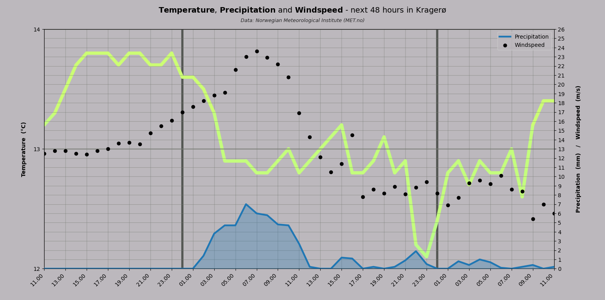

## Overview

The script `norweather_twoday.py` fetches weather data via [MET Weather API](https://api.met.no/) for a given Norwegian municipality, and whose lat. and long. coordinates are found in the `norweather_twoday.csv` catalogue - made with data from [Kartverket](https://www.kartverket.no/). It prompts for the name (Norwegian, not case-sensitive) of a "kommune". Data is then gathered & analyzed, and a plot is presented, along with some details for temperature, precipitation and wind speeds. I've set a max. limit of 48 hrs because past roughly 54 hrs, time intervals would deviate from 1 hr, which complicates plotting decisions slightly. By default uses my custom colormap, assembled in `palette_cold_neutral_warm.py`. Otherwise, e.g. `managua_r` is good.

## Third-Party Data

Weather data provided by the **Norwegian Meteorological Institute (MET.no)** under the [Norwegian License for Open Government Data (NLOD) 2.0](https://data.norge.no/nlod/en/2.0).

### MET.no Terms Compliance

- Data is cached locally with 30-minute expiry to reduce API load
- User-Agent header identifies this application and maintainer
- If-Modified-Since header used for efficient requests
- Attribution displayed in plot and CLI output

**Note**: While the code is public domain, the weather data from MET.no retains its NLOD 2.0 licensing requirements (attribution).

## Usage

```bash
python norweather_twoday.py oslo --hours 24
```

## Prerequisites

Python 3.7+

```bash
pip install requests matplotlib numpy scikit-image
```
where the latter is for the custom colormap.

## Background and process

This short project was made in order to explore basic data analysis & general syntax in Python. Spent some time constructing an intuitive colormap for weather temperature, taking into account colorblindness compatibility. Explored the subject of preceptual uniformity and LAB- and LUV-colorspaces, preferring the latter for this usage. Furthermore, getting uniform gridlines for the two y-axes took a little while.

## Limitations/Notes

Gave up on some expansions, first and foremost API geodata collection, due to issues with modules and/or access. Thus ended up just organizing longitude and latitude data, from Kartverket, in a local file instead ('kommuners koordinater.csv'). On the other hand, dealing with the weather data API was surpisingly uneventful.

## Possibilities

- Geodata via API --> Provide other place name options and expand outside Norway.
- Dynamic choice of variables of interest etc.
- GUI etc.
- Further exploring eyesight compatibility additions.

## Sample Output



## Testing

Sample weather data is provided for testing the script, particularly the grid alignment in plotting. Use the input: 
`sample1`   for an Oslo sample,   w/ larger temperature     range.
`sample2`   for a  Tromsø sample, w/ larger precip./windsp. range.

Have also added a test plot (set `USE_TEST_PLOT` to True), intended for very large temp. range plus some prec. and wind.
