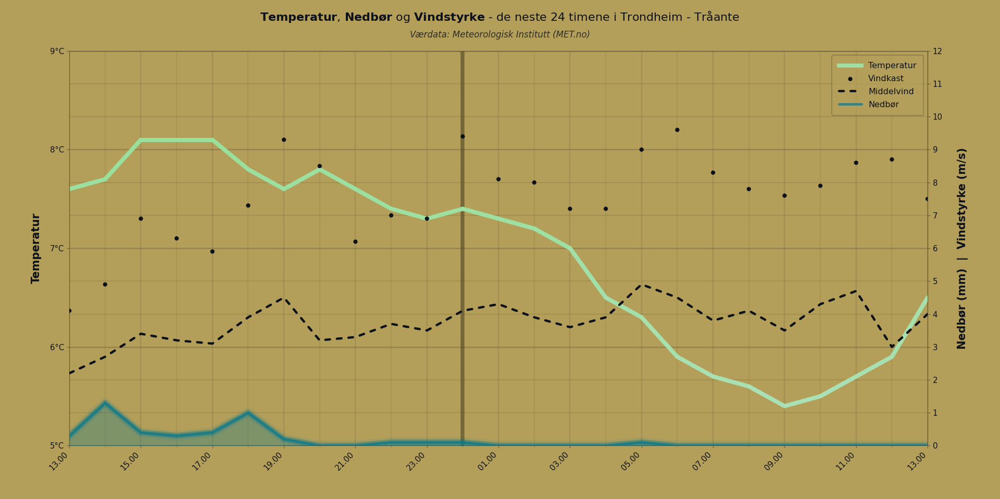

# Norwegian Weather Forecast

## Overview

The script `norweather_twoday.py` fetches weather data via [MET Weather API](https://api.met.no/) for a given Norwegian municipality, and whose lat. and long. coordinates are found in the local catalogue `kommuners_koordinater.csv` - made with data from [Kartverket](https://www.kartverket.no/). It prompts for the name (Norwegian, not case-sensitive) of a municipality (`kommune`). Data is then gathered & analyzed before presenting the forecast as both a visual plot and command-line table showing temperature, precipitation, wind speeds and wind gusts. I've set a max. limit of 48 hrs because past roughly 54 hrs, time intervals would deviate from 1 hr. By default uses custom colormap, defined in `palette_static.py`, which in turn was assembled in `palette_cold_neutral_warm.py`. Otherwise, e.g. `viridis` might be good.

### Wind Data Visualization

The forecast displays both sustained wind speeds and wind gusts:
- **Sustained wind**: Black filled circles (10-minute average)
- **Wind gusts**: Black hollow circles (3-second maximum)

## Third-Party Data

### Municipality Coordinates

Coordinate data for Norwegian municipalities (`kommuners_koordinater.csv`) is derived from:
- **Kartverket** (Norwegian Mapping Authority)
- License: [Norwegian License for Open Government Data (NLOD)](https://data.norge.no/nlod/en/2.0/)
- Source: https://www.kartverket.no/

### Weather Data

Weather forecast data is provided by:
- **Norwegian Meteorological Institute (MET.no)**
- License: [Norwegian License for Open Government Data (NLOD) 2.0](https://data.norge.no/nlod/en/2.0)
- Source: https://api.met.no/

**MET.no Terms Compliance:**
- Data is cached locally with 30-minute expiry to reduce API load.
- User-Agent header identifies this application and maintainer.
- If-Modified-Since header used for efficient requests.
- Attribution displayed in plot and CLI output.

**Note**: While the code is public domain, the weather data from MET.no retains its NLOD 2.0 licensing requirements (attribution).

## Acknowledgements

### Colorblind Simulation

Colorblind transformation matrices derived from:
- **Murtagh, F. and Birch, G. (2006)** "Color blindness and its simulation"
- Via Martin Krzywinski, Canada's Michael Smith Genome Sciences Centre  
- Source: https://mk.bcgsc.ca/colorblind/math.mhtml

Used under academic fair use for accessibility research and implementation.

## Usage

### Basic Usage

```bash
python norweather_twoday.py <kommune> [options]
```

### Examples
```bash
# Basic forecast for Oslo (default 48 hours)
python norweather_twoday.py oslo

# 24-hour forecast for Haugesund
python norweather_twoday.py haugesund --hours 24

# Multi-word municipality (use quotes) or unique word
python norweather_twoday.py "indre fosen"
python norweather_twoday.py fosen

# Duplicate municipality names - multiple options:
python norweather_twoday.py "herøy (møre og romsdal)"  # Full specification
python norweather_twoday.py herøy1                     # Shortcut (alphabetical)
python norweather_twoday.py våler2                     # Second entry

# Plot only (no CLI output), Kragerø
python norweather_twoday.py kragerø --onlyplot

# CLI only (no plot window), Hamar
python norweather_twoday.py hamar --noplot

# Test mode with synthetic data
python norweather_twoday.py --test
```

### Arguments

- `kommune` - Norwegian municipality name (e.g., oslo, kragerø, "indre fosen")
  - For duplicates, specify (fylke): `"herøy (møre og romsdal)"` or shortcuts: `herøy1`, `herøy2`
- `--hours N` - Number of forecast hours (1-48, default: 48)
- `--noplot` - CLI output only, no plot window
- `--onlyplot` - Plot only, suppress CLI output
- `--test` - Use test mode with synthetic data

## Prerequisites

Python 3.7+

```bash
pip install requests matplotlib numpy tzdata
```

### For editing Custom Colormap 

The included colormap (`palette_static.py`) works without additional dependencies. To regenerate or modify the colormap (from `palette_cold_neutral_warm.py`):

```bash
# Requires system dependencies
pip install scikit-image scipy
```

## Background and process

This short project was made in order to explore basic data analysis & general syntax in Python. Spent some time constructing an intuitive colormap for weather temperature, taking into account colorblindness accessibility. Explored the subject of perceptual uniformity and CIELAB and CIELUV color spaces. The colormap is exported as static data to eliminate heavy dependencies. Aligning gridlines in a reasonable manner took a little while too.

## Limitations/Notes

Gave up on some expansions, first and foremost API geodata collection. Thus ended up just organizing longitude and latitude data, from Kartverket, in a local catalogue (`kommuners_koordinater.csv`). On the other hand, dealing with the weather data API was fairly uneventful.

## Possibilities
- Make longer forecasts possible by adding some filtering logic. Guessing this would be straight forward but add lots of lines.
- Geodata via API --> Provide other place name options, expand outside Norway.
- Dynamic choice of variables of interest etc.
- GUI, Web App etc.
- Further exploring accessibility enhancements.

## Sample Output

### Plot Visualization


### Command-Line Forecast

*Example: `python norweather_twoday.py oslo`*

## Repository Structure

- `norweather_twoday.py` - Main weather forecast script
- `palette_static.py` - Pre-computed colormap (no external dependencies)
- `palette_cold_neutral_warm.py` - Colormap generator (development tool)
- `kommuners_koordinater.csv` - Norwegian municipality coordinates catalogue
- `sample_data/` - Sample weather data for testing

## Testing

Test mode generates synthetic data, intented to check functionality with a very large temp. range.

Sample weather data is provided for testing the script, in particular the plot grid alignment.

- `--test` - Synthetic data with extreme temperature range
- `sample1` - Hammerfest sample with precipitation/wind range larger than temperature range.

### Notes

- Use quotes for multi-word municipality names: `"indre fosen"`, `"indre østfold"`
- For duplicate municipality names, specify the fylke: `"våler (østfold)"`, or use shortcut `herøy2`
- For ambiguous names, the script will suggest specific alternatives
- Input is not case-sensitive
